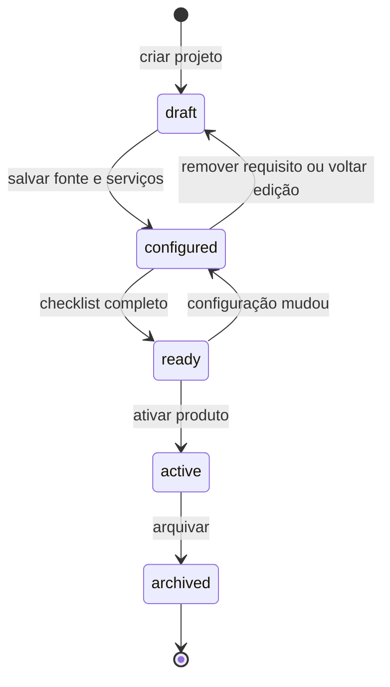

# Design de UX — Projetos, Deploy e ativação de produtos

Status: **[PROPOSTO]**
Revisão: 2026-09-03
Escopo: arquitetura de informação, rotas, estados, correlações de dados e direção visual para as áreas de Projetos e Deploy. A implementação começa somente depois da revisão deste documento.

Este documento transforma o cadastro técnico em um fluxo de produto completo. Ele preserva o Core como fonte de verdade para projeto, contrato, oferta, templates e ativação; Vercel e EasyPanel entram como provedores de execução consultados por adaptadores.

## 1. Evidência do estado atual

### [EXISTENTE E VERIFICADO]

Inspeção feita no ambiente local em 2026-09-03, em `http://127.0.0.1:3100/`, com dados atuais:

- **Deploys** mostra oito projetos Vercel, quatro indicadores, busca, filtro e um inventário EasyPanel na mesma página. O texto informa que tudo é somente leitura, embora EasyPanel já possua ações remotas com confirmação em `resource.js`/`easypanel.js`.
- **Serviços** é a entrada do cadastro. A página lista 16 repositórios GitHub como “Não configurado” e abre `dialog#delivery-dialog` para um wizard de Projeto → Serviços → Revisão.
- O wizard salva a especificação técnica, cria um produto em `draft` para projetos novos e permite ativar o produto em uma ação separada. Ele não apresenta checklist comercial nem uma relação visual entre deploy, oferta, checkout, e-mails, contratos e ativação.
- A tela de recurso já possui rotas hash `#resource?provider=...&target_id=...&environment=...` e abas de configuração, domínios e deploys; ela funciona como detalhe do provedor, mas não como detalhe de um projeto do Core.
- A tipografia e os tokens são consistentes no nível global, porém Deploy, Delivery e Resource ainda combinam cards, diálogos, listas e ações com hierarquia diferente. A captura do wizard mostra um painel modal alto, com três etapas e bastante espaço vazio, enquanto a página atrás continua visível e acionável visualmente.

### Diagnóstico de UX

1. “Projeto”, “serviço”, “deploy” e “recurso do provedor” têm nomes próximos e vivem em telas separadas, sem uma trilha única.
2. O usuário começa por um repositório, mas não sabe qual objeto comercial está sendo criado.
3. O botão de deploy não tem escopo explícito de ambiente, branch, commit, provedor e efeito.
4. A ativação parece uma mudança de status; deveria ser a conclusão de uma lista de requisitos verificáveis.
5. Configurações longas em modal dificultam voltar, compartilhar uma URL, comparar estados e retomar depois.

## 2. Decisão de produto proposta

### 2.1 Um objeto central

O Core terá um **Projeto** como unidade de trabalho. Um projeto pode resultar em um produto ativo, mas nasce como draft. O Projeto possui serviços, ambientes, vínculos de provedor e requisitos comerciais. O deploy é uma execução associada a um serviço e ambiente; ele não é o projeto.

Vercel e EasyPanel serão apresentados dentro do Core com linguagem familiar aos seus painéis, mantendo uma camada comum de navegação e status. Cada campo terá uma origem explícita:

A referência literal dos dois produtos será aplicada aos padrões que resolvem o trabalho — lista de projetos, ambientes, deploy, logs, domínios e ações confirmadas — dentro do detalhe do Projeto. Isso mantém a experiência reconhecível sem criar duas cópias desconectadas do mesmo cadastro.

- **Core** — cadastro, estado, revisão, contrato, oferta, checkout, templates, checklist e auditoria.
- **GitHub** — repositório, branch, commit e metadados de origem.
- **Vercel** — projeto, deploy, domínio e configuração que o adaptador conseguir consultar.
- **EasyPanel** — projeto, serviço, domínio, configuração permitida, operação e auditoria de operação.

O provedor nunca deve ser usado para inferir que um produto está pronto para ser vendido. “Pronto” é um estado composto calculado pelo checklist do Core.

### 2.2 Ciclo de vida do Projeto



Estados do produto vinculado permanecem `draft`, `active` e `archived`, conforme a migração 015. O estado do Projeto descreve a preparação; o estado do produto descreve a disponibilidade comercial.

### 2.3 Estados dos requisitos

Cada requisito exibe `incompleto`, `em revisão`, `pronto` ou `bloqueado`, com origem, última verificação e ação para resolver.

| Requisito | Pronto quando |
|---|---|
| Identidade | Nome, slug interno e responsável definidos |
| Fonte | Repositório, branch padrão e estratégia de monorepo definidos |
| Serviços | Cada serviço tem função, pasta, runtime e dependências válidas |
| Ambientes | Desenvolvimento, homologação e produção possuem vínculo ou decisão explícita de não uso |
| Deploy | Pelo menos uma execução de produção observada como bem-sucedida, quando o projeto exige publicação |
| Domínios | Domínio e protocolo documentados para cada superfície pública |
| E-mails | Templates de eventos obrigatórios revisados no editor do Core |
| Oferta | Preço, moeda, modalidade, processador e versão salvos |
| Checkout | Template visual, modo e oferta padrão salvos |
| Contrato de plataforma | Termos de uso/licença do produto aprovados e versão registrada |
| Contrato de cliente | Modelo e partes definidos; contrato do cliente pronto para assinatura ou registrado |
| Acessos | Operadores, times e permissões compatíveis com o produto |
| Operação | Backup, retenção, restauração e observabilidade registrados quando aplicáveis |

O usuário pode salvar qualquer estado como draft. A ativação fica indisponível enquanto houver requisito obrigatório incompleto e explica cada bloqueio.

## 3. Arquitetura de informação

### Navegação geral

```text
Operação
  Projetos
  Deploys
  Recursos

Comercial
  Produtos e ofertas
  Checkout
  E-mails
  Contratos

Gestão
  Clientes
  Pessoas e acessos
  Financeiro
  Configurações
```

“Serviços” deixa de ser uma entrada paralela e passa a ser uma seção dentro de Projetos. “Deploys” continua sendo uma visão transversal de execuções; “Recursos” é o inventário detalhado dos provedores. O produto só aparece no catálogo comercial depois de ativado.

### Rotas de interface

As rotas abaixo são propostas como URLs hash compatíveis com o app atual, com parâmetros legíveis e retomáveis:

| Rota | Papel |
|---|---|
| `#projects` | Lista, filtros, criação e drafts |
| `#projects/new` | Criação persistente em página |
| `#projects/:id/overview` | Resumo, status, checklist e ações |
| `#projects/:id/source` | GitHub, branch, commit e configuração de origem |
| `#projects/:id/services` | Componentes, dependências e vínculos |
| `#projects/:id/environments` | Matriz ambiente × serviço × provedor |
| `#projects/:id/deployments` | Execuções do projeto, filtros e detalhe |
| `#projects/:id/domains` | Domínios próprios e domínios observados nos provedores |
| `#projects/:id/emails` | Templates e eventos do produto |
| `#projects/:id/checkout` | Editor de checkout e preview |
| `#projects/:id/offers` | Planos, preços, versões e processador |
| `#projects/:id/contracts` | Contrato de plataforma, contrato de cliente e direitos |
| `#projects/:id/readiness` | Checklist completo e evidências |
| `#projects/:id/activate` | Revisão final e confirmação de ativação |
| `#deploys` | Feed transversal de deploys, separado por provedor e estado |
| `#resources` | Inventário Vercel/EasyPanel |
| `#resources/:provider/:target` | Detalhe nativo do recurso, ações conforme permissão |

Uma rota de projeto mantém o contexto do projeto ao navegar entre módulos. A rota de recurso continua útil para um recurso sem projeto vinculado e deve mostrar o vínculo ao projeto quando existir.

## 4. Páginas e fluxos

### 4.1 Lista de Projetos

Cabeçalho: “Projetos” + `Novo projeto`. Abaixo, filtros por estado, origem, provedor e responsável; busca por nome, repositório ou domínio.

Cada linha/card mostra nome, produto vinculado, estado do projeto, estado do produto, último deploy por ambiente, percentual do checklist e próxima ação. O draft deve responder “o que falta” sem abrir um modal.

Estados vazios:

- sem projetos: criar do GitHub ou começar sem repositório;
- sem resultado: remover filtros;
- provedor indisponível: manter o cadastro local e marcar a consulta como indisponível.

### 4.2 Criar projeto

Página persistente com navegação lateral de etapas. O rascunho é criado logo após nome e responsável, com autosave explícito por seção e revisão otimista por `revision`.

1. **Identidade** — nome, slug, responsável, tipo de produto, descrição e marca.
2. **Fonte** — GitHub, repositório, branch, pasta raiz e monorepo.
3. **Serviços** — frontend, API, worker, banco, cache ou biblioteca; dependências e comandos.
4. **Ambientes** — produção, homologação e desenvolvimento; vínculo de cada serviço a Vercel/EasyPanel; consulta de configuração com comparação segura.
5. **Deploy inicial** — escolher serviço, ambiente, branch/commit e destino; mostrar o que será enviado e o que o Core não altera.
6. **Domínios** — domínio público, preview, protocolo e responsável pelo DNS.
7. **E-mails** — criar ou selecionar templates no editor nativo; mapear eventos financeiros e de onboarding.
8. **Oferta e planos** — definir modalidade, preço, moeda, processador, parcelamento, versão e regras de e-mail.
9. **Checkout** — escolher HOSTED, EMBEDDED ou ELEMENTS, editar marca e visualizar desktop/mobile.
10. **Contratos** — modelo de contrato da plataforma, modelo de contrato do cliente, partes e versão.
11. **Acessos e operação** — times, permissões, backups, retenção, restauração e observabilidade.
12. **Revisão** — checklist por seção, evidências, pendências e botão “Salvar draft”.

O usuário pode pular etapas não obrigatórias, mas o checklist registra “não aplicável” com justificativa. Nenhuma etapa chama escrita de provedor por efeito colateral escondido.

### 4.3 Detalhe do Projeto

O detalhe começa em Overview e tem uma barra contextual persistente:

```text
Projeto X · Draft
[Abrir checklist] [Deploy] [Editar]

Overview | Fonte | Serviços | Ambientes | Deploys | Domínios |
E-mails | Checkout | Ofertas | Contratos | Acessos | Atividade
```

O topo mostra produto vinculado, repositório, ambiente de produção, último deploy observado e a próxima ação. Um painel lateral de “Prontidão” permanece visível em desktop e vira uma faixa fixa no mobile.

### 4.4 Deploy

O fluxo de publicação é uma página ou drawer contextual curto, com quatro partes:

1. **Escopo** — projeto, serviço, ambiente e provedor selecionados explicitamente.
2. **Origem** — branch ou commit; mostrar mensagem, autor e SHA curto.
3. **Pré-voo** — conexão, destino, variáveis referenciadas sem exibir segredos, domínio e permissões.
4. **Confirmação e acompanhamento** — resumo da operação, botão inequívoco e timeline de estado.

Cada execução recebe `queued`, `building`, `ready`, `error`, `canceled` ou `unknown`, além de `provider`, `service`, `environment`, `source_revision`, `created_at`, `finished_at` e links externos. O Core só oferece escrita quando o adaptador tiver uma operação segura e idempotente. O deploy não ativa o produto automaticamente.

### 4.5 Recursos Vercel/EasyPanel

`Resources` é o lugar para navegar pelo inventário externo. O detalhe mantém abas conhecidas de cada provedor, mas sempre exibe:

- origem do dado e horário da consulta;
- escopo da credencial;
- modo `somente leitura`, `ação com confirmação` ou `indisponível`;
- vínculo com Projeto, serviço e ambiente;
- diferença entre estado observado no provedor e estado esperado no Core.

Operações EasyPanel continuam em duas fases: preparar, exibir resumo e pedir confirmação com o identificador do destino; executar; consultar auditoria. Vercel começa em leitura e pode receber Deploy Hooks por branch em uma fase posterior, sem colocar token de escrita no navegador.

### 4.6 E-mails, checkout, ofertas e contratos

Esses módulos devem ser páginas do projeto, com edição e preview lado a lado:

- **E-mails**: biblioteca de templates, editor de assunto/corpo/variáveis, eventos cobertos, teste em destinatário de desenvolvimento e versão. O envio real fica fora até existir integração aprovada.
- **Ofertas**: editor de preço em centavos, moeda, modalidade, parcelas, processador e versão. O rótulo do plano continua separado de autorização.
- **Checkout**: editor de marca e modo, preview responsivo e vínculo a uma oferta padrão. Nunca inventar uma sessão de pagamento no editor.
- **Contratos**: contrato de plataforma e contrato de cliente são documentos versionados; direitos técnicos (`entitlements`) são consequência registrada, não substituto do documento comercial.

### 4.7 Ativação

A rota `#projects/:id/activate` é uma revisão final. Ela lista todas as pendências, suas evidências e a mudança exata: `products.lifecycle_status: draft → active`. A confirmação exige revisão atual (`revision`) e registra operador, data, versão do projeto e resumo do checklist. Arquivar remove o produto do catálogo ativo, sem apagar histórico.

## 5. Correlações de dados

### Relação principal

```text
Project (delivery_projects)
  ├─ 1:1 Product (products, draft → active)
  ├─ 1:N Services (hoje em specification.components[]; normalizar depois)
  ├─ 1:N Environment bindings (hoje em components[].bindings[])
  ├─ 1:N Deploy observations (provedor; persistir snapshot mínimo)
  ├─ 1:N Domains
  ├─ 1:N Email templates / event mappings
  ├─ 1:N Billing offers (billing_offers)
  ├─ 1:N Checkout templates (checkout_templates)
  ├─ 1:N Platform contracts [proposto]
  ├─ 1:N Customer contracts [proposto]
  ├─ N:N Tenants through entitlements
  └─ 1:N Audit events / delivery_audit / provider operations
```

### Matriz de fonte e dependência

| Tela | Fonte principal | Dependências | Pode alterar provedor? |
|---|---|---|---|
| Projetos | `delivery_projects`, `products` | GitHub opcional | Não |
| Fonte | GitHub + `specification` | credencial GitHub | Não |
| Serviços | `specification.components` | stacks e tipos | Não |
| Ambientes | bindings + inventários | Vercel/EasyPanel | Apenas operação aprovada |
| Deploys | Vercel/EasyPanel | projeto/serviço/ambiente | Futuro, por adaptador |
| Ofertas | `billing_offers` | produto ativo ou draft controlado | Não |
| Checkout | `checkout_templates` | oferta e produto | Não |
| E-mails | templates e regras de oferta | eventos de `billing.mjs` | Não envia |
| Contratos | `entitlements` + tabelas contratuais futuras | tenant, produto, oferta | Não |
| Ativação | `products.lifecycle_status` | readiness completo | Só altera Core |

### Evolução de schema

A especificação JSONB atual é adequada para o primeiro draft e preserva compatibilidade. Para o editor completo, a próxima migração deve separar `project_services`, `project_environments`, `project_bindings`, `project_domains` e `project_requirements`, mantendo um snapshot da especificação para auditoria e importação. Isso evita que cada tela conheça caminhos JSON diferentes e permite histórico por seção.

Contratos comerciais devem ser modelados separadamente de `entitlements`: o primeiro guarda partes, documento, versão, assinatura e status; o segundo continua representando o direito técnico que o produto consulta.

## 6. Contrato de API proposto

As rotas existentes continuam funcionando durante a migração. A camada nova pode compor as mesmas consultas sem expor tokens.

| Rota proposta | Substitui/compõe |
|---|---|
| `GET /api/projects` | `/api/delivery/projects` |
| `POST /api/projects` | criação em `/api/delivery/projects` |
| `GET/PATCH /api/projects/:id` | `/api/delivery/projects/:id` |
| `GET /api/projects/:id/readiness` | `projectIssues()` + novas verificações |
| `GET/PATCH /api/projects/:id/source` | `specification.repository_*` |
| `GET/PATCH /api/projects/:id/services` | `specification.components[]` |
| `GET/PATCH /api/projects/:id/environments` | `components[].bindings[]` |
| `GET /api/projects/:id/deployments` | `/api/deploys` + observações do projeto |
| `POST /api/projects/:id/deployments` | operação futura do adaptador |
| `GET/PATCH /api/projects/:id/domains` | dados de recurso + cadastro Core |
| `GET/PATCH /api/projects/:id/email-templates` | `/api/emails` + editor futuro |
| `GET/PUT /api/projects/:id/offers` | `/api/billing/offers` |
| `GET/PUT /api/projects/:id/checkout` | `/api/checkout-templates` |
| `GET/POST /api/projects/:id/contracts` | `entitlements` + contratos comerciais futuros |
| `POST /api/projects/:id/activate` | `/api/delivery/projects/:id/activate` |
| `GET /api/providers/:provider/resources/:id` | `/api/platforms/resource` |

Toda mutação usa revisão, resposta normalizada, auditoria transacional e mensagens em português. Escrita de provedor inclui idempotency key, estado `unknown` quando a resposta é inconclusiva e link para auditoria.

## 7. Migração do popup para páginas

1. Manter `delivery.js` como adaptador de dados e validação durante a transição.
2. Criar o shell de projeto com URL e navegação persistentes.
3. Mover Identidade, Fonte e Serviços para páginas; o botão “Configurar” passa a abrir `#projects/new?repository_id=...`.
4. Transformar Ambiente em matriz editável e deixar comparação de provedor em painel lateral contextual.
5. Criar páginas de E-mails, Ofertas, Checkout e Contratos com drafts próprios.
6. Substituir a revisão modal por `readiness` e `activate`.
7. Remover o `<dialog>` quando nenhuma etapa depender dele. Dialogs ficam somente para confirmação curta, destrutiva ou de operação remota.

O autosave não deve esconder erros. Cada seção mostra “salvo há X”, revisão atual e uma ação de retry. Sair da página preserva o draft; mudanças concorrentes exigem reabertura.

## 8. Direção visual e CSS

### Tipografia

- Uma família sans local, preferencialmente Geist se o asset for autohospedado; fallback `Inter, Segoe UI, Arial, sans-serif`.
- Escala: 12 auxiliar, 14 corpo, 16 rótulo de seção, 20 título de página, 28 destaque, 36 apenas para métricas.
- Peso 400 para texto, 500 para controles, 600 para títulos. Evitar caixa alta em títulos; usar eyebrow apenas para contexto.
- Altura de linha 1.45 no corpo e 1.2 em títulos. Números usam `font-variant-numeric: tabular-nums`.

### Tokens base

```css
:root {
  --canvas: #f7f8fa;
  --surface: #ffffff;
  --surface-subtle: #f1f3f5;
  --ink: #18202a;
  --muted: #667085;
  --line: #e4e7ec;
  --brand: #4a21bb;
  --brand-soft: #f1edfa;
  --success: #16794a;
  --warning: #9a6700;
  --danger: #b42318;
  --radius-sm: 6px;
  --radius-md: 10px;
  --radius-lg: 14px;
  --shadow-panel: 0 8px 24px rgb(16 24 40 / 5%);
}
```

Os valores finais devem ser medidos contra o institucional e registrados em `DESIGN-SYSTEM.md`; o bloco acima é direção para o novo shell, não uma autorização para duplicar tokens em cada módulo.

### Componentes obrigatórios

`PageShell`, `PageHeader`, `ContextBreadcrumb`, `StatusBadge`, `ReadinessCard`, `SectionTabs`, `DataTable`, `FilterBar`, `SplitPane`, `EnvironmentMatrix`, `Timeline`, `ProviderBadge`, `EmptyState`, `InlineNotice`, `ConfirmDialog`.

Cada módulo CSS deve consumir tokens e componentes, sem estilos inline gerados por strings. Classes devem seguir um vocabulário único (`project-*`, `deploy-*`, `provider-*`) e não misturar regras globais com regras de módulo. Cards precisam de hierarquia: título, estado, evidência e ação; não usar card apenas como moldura.

### Regras de visualização

- Fundo de canvas levemente cinza e superfícies brancas para separar áreas de trabalho.
- Uma ação primária por cabeçalho; ações secundárias ficam agrupadas.
- Status sempre combina cor, texto e ícone; cor sozinha não comunica estado.
- Tabelas têm coluna de próxima ação e rolagem interna quando necessário.
- O detalhe do projeto usa duas colunas em desktop: conteúdo principal e prontidão; uma coluna no mobile.
- Modal somente para decisão curta. Formularios longos, editores e comparações ocupam rota própria.
- Foco, teclado, contraste, 44px de alvo móvel e textos de erro seguem `DESIGN-SYSTEM.md`.

## 9. Estado implementado nesta etapa

O portfólio agora abre um contexto persistente por produto. Os cartões exibem o identificador e o número de contratos, usam o `logo.svg` local como favicon e levam para as abas de **Cobrança** e **E-mails** sem modal. A cobrança foi convertida para editor inline; o editor de e-mails tem lista por evento, assunto, preheader, corpo, variáveis, prévia e salvamento versionado em draft. O conteúdo permanece separado da oferta e o envio ainda não é ativado.

Projetos agora também mostra o inventário observado na Vercel e no EasyPanel quando `delivery_projects` está vazio. Um projeto Vercel pode ser adotado como draft; serviços EasyPanel permanecem observados até serem classificados. O cadastro local tem criação, edição com revisão otimista e exclusão protegida de drafts sem contratos. **Gestão técnica** exibe apenas os metadados do PostgreSQL do TZOLKIN Core, além de caches Redis observados, aplicações/APIs e um checklist operacional; nenhum valor de banco, chave Redis ou segredo é enviado ao navegador.

## 10. Fases de implementação

### Fase A — fundação

Rotas de projeto, shell, lista, overview, readiness, estado do produto e modelo de requisitos. Nenhuma escrita nova em Vercel/EasyPanel.

### Fase B — fonte e execução

Fonte, serviços, matriz de ambientes, detalhe de recurso, deploy explícito e timeline. Persistir observações mínimas de deploy para o histórico do Projeto.

### Fase C — produto vendável

Editor de e-mails, ofertas, checkout, contratos e correlações com `tenants`, `entitlements` e `app_clients`.

### Fase D — ativação e operação

Checklist completo, confirmação de ativação, contratos versionados, backup/retention/restore registrados e operações de provedor com idempotência.

### Critérios de aceite da primeira entrega

- Nenhum formulário longo depende de modal.
- Um draft pode ser fechado e retomado pela URL.
- O detalhe mostra claramente projeto, produto, serviço, ambiente, provedor e revisão.
- Deploy exige serviço, ambiente e origem explícitos e nunca ativa produto sozinho.
- O botão de ativação explica todos os bloqueios e só altera `draft → active` após revisão válida.
- Vercel e EasyPanel exibem origem, horário, escopo e modo de operação.
- E-mail, checkout, oferta e contrato aparecem como requisitos correlacionados do mesmo projeto.
- Desktop e mobile passam por revisão página a página antes de considerar o módulo pronto.

## 11. Decisões que precisam de confirmação antes da Fase C

1. Qual modelo de contrato de plataforma deve ser obrigatório para cada produto?
2. O contrato de cliente será apenas cadastro de documento ou terá assinatura eletrônica integrada?
3. Quais requisitos são obrigatórios para cada tipo de projeto (site, API, worker, produto interno)?
4. Qual provedor é o executor oficial por ambiente quando Vercel e EasyPanel oferecem destinos equivalentes?
5. A fonte Geist será autohospedada no Core ou a pilha de sistema permanece a opção oficial?

Até essas respostas, o trabalho recomendado é Fase A e a migração visual da fundação. O documento é uma proposta de design e arquitetura; ele não altera o estado atual do aplicativo.
