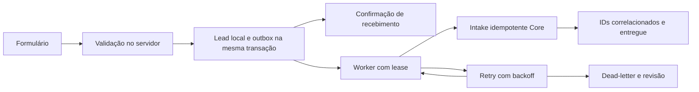
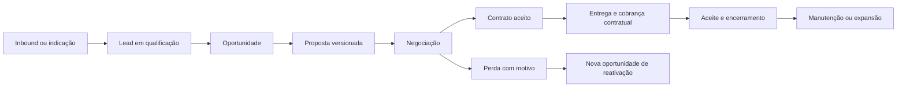

# Jornadas e estados — proposta

Data: 07/09/2026. Diagramas descrevem o destino recomendado, não uma jornada já implementada. Estado atual por etapa aparece nas tabelas.

## J0 — Captação e entrega Site → Core

Atual: formulário, validação, persistência e email_outbox implementados; outbox Core/worker ausentes; intake parcial. E-mail tem ciclo separado: falha em e-mail não deve desfazer lead ou marcar ingestão Core como falha.

Estados propostos da entrega: pending → processing → delivered; processing → retry_wait → processing; tentativas esgotadas → dead_letter; revisão autorizada → pending mantendo event_id. Crash após commit no Core e antes de confirmar entrega deve produzir replay com mesmos IDs. Consentimento/preferência não é inferido do sucesso técnico.

## J1 — Serviço sob demanda, consultoria e assessoria

Lead identifica interesse, oportunidade identifica tentativa de venda, empresa/PF identifica parte, stakeholder identifica interlocutor. A conversão não concede acesso automaticamente. Sites não apresenta checkout público de aquisição; contrato aceito pode gerar cobrança em etapas. Consultoria entrega orientação/artefato; assessoria entrega execução continuada; nenhuma exige um SaaS fictício.

Atual: intake cria prospect, stakeholder, engagement planned e lead open na mesma operação. Oportunidade e proposta próprias, negociação e contrato com aceite não foram localizados. Tracking/horas e vínculos de execução existem parcialmente.

Aceite: entrada sem empresa é possível; propostas preservam versões; perda exige motivo; reativação mantém histórico; uma pessoa pode representar empresas diferentes; serviço pode encerrar sem apagar cliente.

## J2 — SaaS (Barber; Skiller depende de ficha funcional)

Aquisição por indicação/demonstração/venda consultiva ou checkout permitido → comprador identificado → pedido → pagamento confirmado → contrato/assinatura → organização e membership → direitos → onboarding no produto → uso → renovação/expansão ou cancelamento.

Atual: ofertas, gateway Stripe, webhooks e entitlements existem no código. Isso não comprova ligação completa entre pagamento e organização contratante. Não há prova de onboarding nos produtos externos. Documento antigo com assinaturas Skiller não demonstra conciliação atual.

Aceite: identificar parte contratante por referência explícita, não só e-mail; webhook autenticado e idempotente; tela de sucesso não concede direito; pagamento pendente/falho não ativa; cancelamento financeiro e expiração de direito têm políticas separadas; expansão versiona contrato sem duplicar organização.

## J3 — Educacional

Interesse → oferta/turma → comprador PF ou empresa → inscrição → pagamento/condição contratual → matrícula no produto → direito de acesso → progresso no produto → conclusão/expiração. Cancelamento e reembolso são ramificações independentes.

Atual: education existe no vocabulário, mas intake a converte para on_demand; não há fluxo de matrícula/progresso no Core inspecionado. Não modelar aluno obrigatoriamente como empresa. Empresa patrocinadora, comprador e aluno podem ser pessoas diferentes.

Aceite: comprador e beneficiário separados; matrícula pertence ao produto; Core recebe só referência e direito necessários; cancelamento da oferta não apaga histórico de conclusão; turmas e conteúdos não viram tabelas genéricas do Core.

## J4 — Operação de cliente dentro do produto

Usuário final autentica no produto → backend verifica tenant, vínculo e direito → executa agenda/pedido/estoque/matrícula localmente → produz agregado aprovado, quando necessário.

Atual: GET /v1/context existe; consumidor/agenda/OMS dos produtos externos não auditados. Core indisponível não autoriza novos direitos. Prazo de cache e janela de revogação precisam ser decididos por risco e testados, não assumidos.

Aceite: tenant forjado e ID direto não atravessam escopo; jobs/exportações obedecem mesmas regras; revogação chega na janela acordada; lead de cliente não entra no comercial TZOLKIN.

## J5 — Administração e governança

Operador autentica → permissão específica é verificada → seleciona contexto → executa ação → auditoria registra ator/alvo/resultado. Produto draft pode ser configurado, mas elegibilidade para venda é uma decisão separada de status técnico.

Atual: autenticação geral e owner em contas/times; ações de chave sem guarda owner própria e sem auditoria. Catálogo e alguns contratos aceitam draft. Não presumir que filtrar tela elimina permissão no servidor.

Aceite: testar criar produto, ativar contrato, mudar preço, conceder acesso, publicar, exportar e apagar com atores permitidos e negados. Registro técnico de auditoria não deve depender de existir cliente quando a ação é global.

## J6 — Execução de serviço e infraestrutura

Contrato/ordem de trabalho → projeto e responsáveis → milestones/tarefas → homologação → aprovação → deploy quando aplicável → observação → aceite → manutenção/encerramento. Falha de deploy → rollback técnico; rollback não cancela contrato automaticamente.

Atual: delivery_projects, service_deploy_bindings, tracking, apontamentos e operações técnicas presentes. Milestones/SLA/anexos/aceite contratual completos não comprovados. Produto e serviço têm vínculos técnicos separados, direção que deve ser mantida.

Aceite: cada recurso tem ambiente e dono; mudança remota ambígua exige reconciliar antes de repetir; backup restaurado em base isolada; entrega exige evidência de aceite e não apenas deploy verde.

## Estados independentes

| Agregado | Atual observado | Proposta / regra de transição |
|---|---|---|
| Lead | open, qualified, won, lost, archived no SQL; sem operação completa | Estágio com histórico; dono e perda motivada. Ao criar oportunidade, preservar lead/origem |
| Oportunidade | Ausente como agregado próprio | qualified → proposal → negotiation → won/lost; reativação cria tentativa ligada à anterior |
| Organização comercial | lead/onboarding/active/paused/completed/discontinued/unclassified | Relação com a empresa não termina por perder uma oportunidade |
| Tenant técnico | active/suspended | Suspender acesso não apaga empresa nem histórico |
| Engagement | planned/active/paused/completed/discontinued/unclassified | Execução do serviço; não prova pagamento/aceite |
| Contrato comercial | Parcial, representado por engagement/entitlement | draft → review → accepted → active → fulfilled/terminated/expired; aditivo versionado |
| Entitlement | active e version | Derivar de contrato/política; revogação monotônica; não confundir com preço |
| Produto | draft/active/archived | Elegibilidade comercial e saúde técnica separadas |
| Pagamento | Eventos/charges presentes; jornada não comprovada | pending → paid/failed/canceled; refunded/disputed são eventos posteriores; conciliar |
| Assinatura | Fluxo completo não comprovado | pending → active → past_due → canceled/expired conforme política do provedor e contrato |
| Matrícula | Não localizada no Core, operação do produto | pending → enrolled → completed/canceled; direito expira sem apagar conclusão |
| Entrega técnica | Projetos/vínculos/operações presentes | planned → executing → review → approved → deployed → accepted; failed/rollback separados |

## Relatórios e origem

Funil usa oportunidades e eventos datados, não quantidade de organizações. Receita usa pagamentos conciliados, previsão usa agenda contratual. Margem requer custo direto e regra de alocação explícita; horas apontadas não bastam sem custo. Utilização requer capacidade disponível. Retenção exige coortes e critério de cliente ativo. Saúde técnica exige observação datada, não campo status do catálogo.

Origem proposta: touch_id, lead_id, canal, campanha/UTMs, indicador de indicação, instante e fonte. Primeiro toque e último toque são projeções do histórico; não sobrescrever o primeiro. A tabela atual de atribuição 1:1 não implementa esse modelo. Não atribuir receita a campanha sem ligação rastreável até oportunidade/contrato/pagamento.

## Critérios de encerramento da etapa de desenho

1. Cada frente do catálogo aponta uma jornada e uma parte vendedora/recebedora.
2. Cada estado possui dono, entrada, saída, ação autorizada e evento de auditoria.
3. A API não converte silenciosamente education/consulting/advisory em on_demand.
4. Inbound, checkout, pós-venda e operação têm navegação e métricas coerentes com seus próprios agregados.
5. A lista de exceções está registrada; a equipe consegue explicar qual dado fica em cada sistema antes de criar novas telas.
